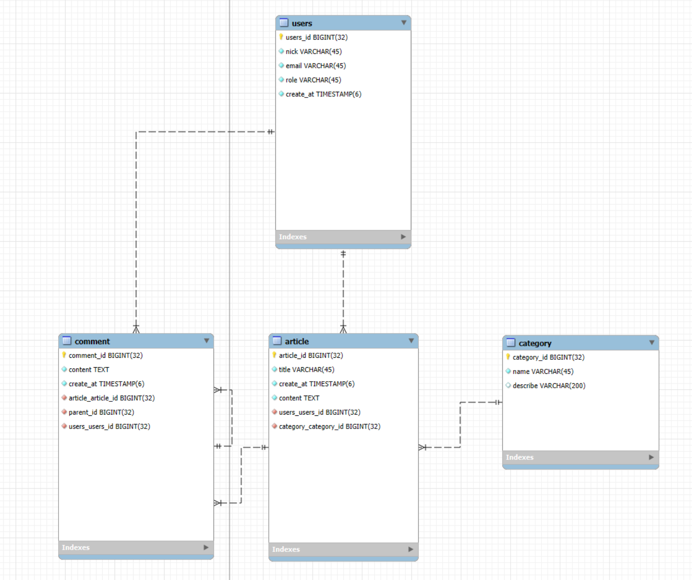

# JaeTech
재테크, 나만의 기술 블로그웹 프로젝트 

## 프로젝트 개요
- 프로젝트 이름
- 프로젝트 목적 및 목표
- 주요 기능 설명
- 대상 사용자(본인/ 개발자 커뮤니티 등)
- 기술 스택 개요 (Frontend, Backend, DB, CI/CD 등)

### 프로젝트 이름

**재테크 JaeTech** Blog

내 이름인 재우와 테크 블로그의 테크를 합쳐서 재테크

### 프로젝트 목적 및 목표

> 내가 공부한 내용을 정래해두고, 기술을 공유할 수 있는 나만의 블로그를 만드는 것이 목적이다.  
> 단순히 개인 공부 정리뿐만 아니라 나와 같이 공부하며 개발의 실력을 늘리고 싶은 사람들에게 유용한 정보를 제공하고 서로 공유하는 사이트로 발전시키고 싶다.
>

꾸준히 블로그를 관리하며 업데이트를 진행하며  유지보수하는 것이 목표이다.

### 주요 기능 설명

- 게스트들은 내가 작성한 모든 글을 읽을 수 있다.
- 블로그 주인은 글을 쓰고 수정 삭제 관리를 할 수 있다.
- 역할기반 기능으로 게스트들은 글을 생성, 삭제, 수정 할 수 없다.
- 게스트들은 댓글을 달 수 있다.
- 대댓글이 가능하다.
- 글을 쓸 때 마크다운으로 쓸 수 있다. - 라이브러리를 찾아 적용한다.
- 대댓글은 1단계까지만 가능하다.

### 기술 스택 개요

Backend : SpringBoot, MySQL, Docker

Frontend : Thymleaf, js, ajax

CI/CD : AWS, Jenkins,

## 데이터베이스 설계
- ERD
- 주요 테이블 및 관계 정의
- 데이터 정규화 고려 사항
- 쿼리 최적화 전략
- 인덱싱 및 캐싱 전략

### ERD

    

### 각 테이블 및 관계 정의
- Users 테이블
  - 기본 키 : `user_id`
- category 테이블
  - 기본 키 : `category_id`
  - 설명 : 게시글의 분류 정보를 저장합니다.
- article 테이블
  - 기본 키 : `article_id`
  - 외래 키 : 
    - `users.user_id` : 해당 게시글을 작성한 사용자를 참조합니다.
    - `category.category_id` : 게시글이 속한 카테고리를 참조합니다.
  - 설명 : 게시글의 제목, 내용, 작성일 등을 저장합니다.
- comment 테이블
  - 기본 키 : `comment_id`
  - 외래 키 : 
    - `article.article_id` : 댓글이 달린 게시글을 참조합니다.
    - `users.user_id` : 댓글을 작성한 사용자를 참조합니다.
    - `parent_id` : `comment.comment_id` 대댓글(답글) 구현을 위한 자기 참조 키로, 부모 댓글을 가리킵니다.
  - 설명 : 게시글에 달린 댓글 및 대댓글 정보를 저장합니다.

